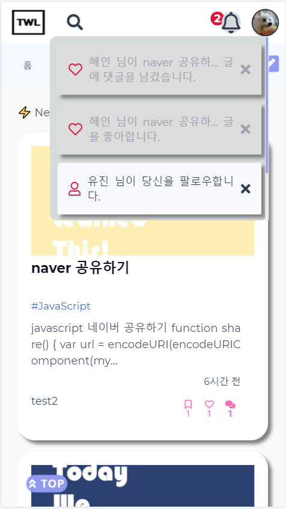
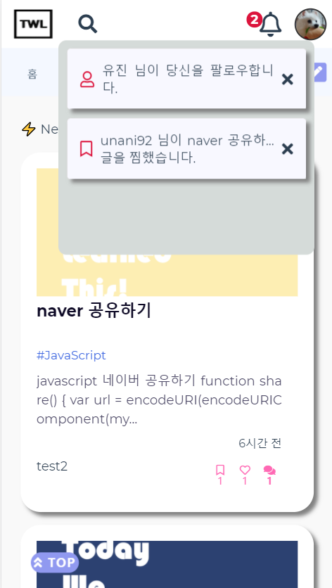

# TWL: Today We Learned


## Intro

### :thumbsup: 서비스 소개

개발자가 되고 싶은 우리들은 매일같이 **TIL**을 만들고 깃허브에 올리지만,

블로깅은 엄두도 내지 못하는 사람들이 있습니다.

우리들의 관심사 는 다르고 매일 공부하는 것도 다릅니다.

그래서 준비했습니다. **꿈나무들의 TIL을 모두 모아볼 수 있는 커뮤니티 TWL** 지금부터 시작합니다.

#### 배포 주소

http://i3a407.p.ssafy.io/

### **:person_frowning: 팀원 소개**

#### Back-End

배유진 - JWT / Google Login, 게시글 관리, 서버 배포

전혜인 -

#### Front-End

신영찬

정윤환

### **:symbols: 사용한 기술**

## 서비스 주요 기술 소개

### 0. :key: 사용자 인증

<br/>

:key: 로그인

<br/><br/>

<center>


</center>
<br/>
<br/>
<br/>

--- 

<br/>
<br/>


:page\_with\_curl: 회원가입

<br/>
<br/>


<center>


</center>


이메일 인증을 거쳐 가입이 가능합니다.

소셜 회원의 경우, 이메일을 제외한 정보를 입력하시면 됩니다.

<br/>
<br/>
<br/>


<center>

</center>

가입 시 관심있는 기술분야를 추가할 수 있습니다
<br/>
<br/>
<br/>


### 1. :pencil2: 마크다운 에디터 CRUD

- 게시글 작성


( 사진 좌: 게시글 작성 | 우: 드래그 & 드랍 이미지 삽입 )

- 게시글 조회

 ! 

( 좌: <1> 작성자 본인은 수정, 삭제, 마크다운 다운로드 가능 <2> 팔로우, 좋아요, 핀, 게시글 url 복사 )

( 중: url 복사 실제 화면 ) ( 우: 디테일 페이지 하단면, 댓글 작성란 )

### 2. :mag: 개인 관심사 기반 게시글 큐레이션

- 관심사 선택

   

  ( 사진 좌: 회원가입 페이지 관심사 선택 | 우: 마이페이지 관심사 선택)

* 최신글 / 팔로우 / 북마크 모아보기 탭

 

- 관심사, 좋아요 기반 관심글 추천

  

* 키워드 검색 및 기타 검색기능

 

### 3. 마이페이지

#### 3.1 architecture


###### vue2DropZone은 서드파티 라이브러리

`MyArticleCardList`에서 백엔드 서버로 요청을 보내어 개인 정보와 해당 닉네임 유저가 작성한 글들을 모두 가져온다. 그리고 각 컴포넌트에 필요한 정보들을 `props`와 `$emit`을 이용해 전달한다.

#### 3.2 캘린더 기능


날짜를 클릭하면 해당 날짜에 작성한 글들만 모아볼 수 있다. 해당 화면을 보여줄 때, 아래 컴포넌트 구조로 다시 렌더링 된다.


#### 3.3 등급


점수 산정 : 글 작성 시 10점, 댓글 작성 시 3점, 자신의 게시글에 좋아요 받을 때 1점

NEW : 10점 미만

BRONZE : 50점 미만

SILVER : 150점 미만

GOLD : 300점 미만

PLATINUM : 600 미만

DIAMOND : 600 이상

#### 3.4 회원 정보 조회 및 수정


### 4. 🔔알림
- notification <br/><br/>

&nbsp;&nbsp;&nbsp;&nbsp; 


   &nbsp;&nbsp;( 사진&nbsp;&nbsp;&nbsp;&nbsp; 좌: 알림 &nbsp;&nbsp;  | &nbsp;&nbsp; 중간: 알림 확인  &nbsp;&nbsp; | &nbsp;&nbsp;  우: 읽은 알림 삭제 )

<br>

#### 4.1 DAO
```java
   // 새로운 알림 생성
   Notification save(NotificationMultiId notification);
   // 총 알림 개수 리턴
   @Query(value = "SELECT count(readn) FROM notification where ready = 0 and email = ?1", nativeQuery = true)
   int countByEmail(String follow);
   // 최근 30일간의 알림 리턴
   @Query(value = 
   "select * from notification where email = ?1 and date(createtime) > date(subdate(now(), INTERVAL 2 DAY)) order by notificationid desc" 
   , nativeQuery = true)
   List<Notification> findAllIn30Days(String email);
   // 안읽은 알림만 리턴
   @Query(value = 
   "select * from notification where email = ?1 and date(createtime) <= date(subdate(now(), INTERVAL 30 DAY)) and ready = 0 order by notificationid desc" 
   , nativeQuery = true)
   List<Notification> findAllUnread(String email);
   // 알림 삭제
   @Transactional
   int deleteByNotificationid(int notificationid);
   // id로 알림 찾기
   Notification findNotificationByNotificationid(int notificationid);
   // 모든 조건이 일치하는 알림 찾기 (댓글용)
   @Query(value = 
   "select * from notification where email = ?1 and other = ?2 and type = ?3 and articleid = ?4 and content = ?5 and readn = ?6"
   , nativeQuery = true)
   Notification findNotification(String email, String other, String type, int articleid, String content, int readn);
   // 조건이 일치하는 알림 삭제 (댓글용)
   @Transactional
   int deleteByOtherAndArticleidAndTypeAndReadn(String other, int articleid, String type, int readn);
```


#### 4.2 Controller
     - 댓글 작성, 좋아요, 북마크, 팔로우를 누른 경우
      -> 새로운 알림을 db에 저장
     ```java
        Notification notification = new Notification();
        notification.setContent(content);
        notification.setEmail(article.getEmail());
        notification.setNickname(userDao.findUserByEmail(article.getEmail()).get().getNickname());
        notification.setOther(other);
        notification.setOthernickname(userDao.findUserByEmail(other).get().getNickname());
        notification.setType(type);
        notification.setReadn(0);
        notification.setArticleid(article.getArticleid());
        notificationDao.save(notification);
     ```
     - 전체 알림 목록을 보여주는 경우
      -> 최근 30일간의 알림 중 읽지 않은 알림만 리턴
     ```java
        List<Notification> notificationList = notificationDao.findAllIn30Days(email);
        notificationList.addAll(notificationDao.findAllUnread(email));
     ```
     - 알림을 읽은 경우
      -> id를 이용하여 해당하는 알림을 찾아 setReadn, setReady를 이용해 읽음 표시
     ```java
        Notification notification = 
        notificationDao.findNotificationByNotificationid(notificationid);
        if(notification.getReady() == 0)
        {
            notification.setReadn(1);
            notification.setReady(1);
            notificationDao.save(notification);
        }
     ```
     - 알림을 삭제하는 경우
      -> id를 이용해 알림 삭제
     ```java
        notificationDao.deleteByNotificationid(notificationid)>0
     ```


## 문제 해결 및 문서 정리

### 1. FrontEnd

1-1. ToastUi Editor

1-2. Firebase Storage

1-3. Drag & Drop

1-4. AutoComplete

1-5. Social Login

### 2. BackEnd
